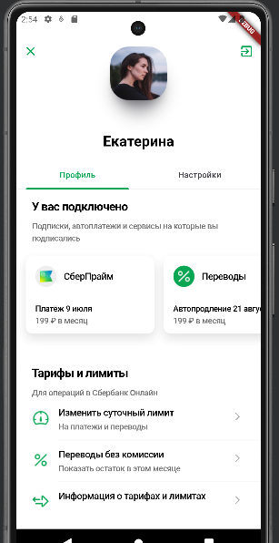
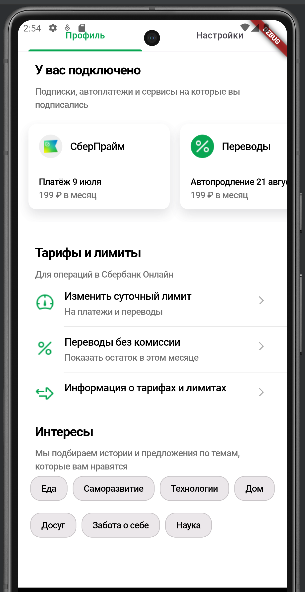

# flutter_project

## Описание проекта
Это проект приложения, написанный на Dart с использованием Flutter. На экране присутствуют следующие элементы:

- **Кнопки выхода**: Кнопки для выхода из приложения.
- **Аватар**: Аватар пользователя.
- **Имя**: Имя пользователя.
- **Кнопки навигации**: Кнопки для навигации по приложению.
- **Заголовок для карточек**: Заголовок для карточек приложения.
- **Карточки**: Карточки приложения.
- **Заголовок операций**: Заголовок для кнопок операций.
- **Кнопки операций**: Кнопки операций сбера.
- **Заголовок интересов**: Заголовок для кнопок интересов.
- **Кнопки интересов**: Кнопки интересов пользователя.

## Структура проекта
- **`main`**: Главный файл для компиляции всего приложения.
- **`Develop`**: Файл с вызовом тела приложения.
- **`appBar`**: Папка с реализацией шапки приложения.
- **`card`**:  Папка в которой написана реализация карточек.
- **`Chips`**: Кнопки интересов пользователя.
- **`Information`**: Информация о тарифах.
- **`TariffsAndLimits`**: Карточки с тарифами.
- **`TextConnection`**: Заголовки приложения.

## Технологии
- Flutter, Dart

## Как использовать
1. Клонируйте репозиторий.
2. Откройте проект в вашей IDE. Желательно в AndroidStudio.
3. Запустите проект и убедитесь, что у вас установлены все необходимые зависимости.

На момент написания
Версия flutter: 3.16.0
Версия Dart: 3.2.0
Версия DevTools: 2.28.2
Версия Android Studio Giraffe: 2022.3.1 Patch 2
Работал в Android Studio
Проверял на телефоне: Pixel 7 API 31

## Автор
Шереметьев Кирилл Алексеевич